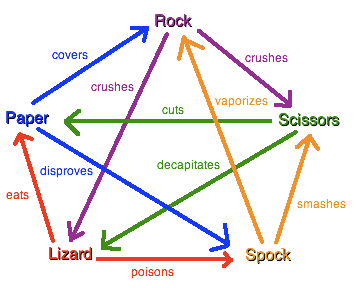

 
# Game of Rock Paper Scissors Spock Lizard
This game was mentioned in both the popular American series "Star Trek" and "Big Bang Theory".  

The site is responsive to viewing on mobiles, tablets, laptops, and desktops.  

Please view the game live project [here](https://caylindewey.github.io/project2-v2/).

- - -

# Table of Contents

## [User Experience](#user-experience-1)
### [User Stories UX](#user-stories-ux-1)
#### [First Time Visitor Goals](#first-time-visitor-goals-1) 
#### [Returning Visitor Goals](#returning-visitor-goals-1)
#### [Frequent Visitor Goals](#frequent-visitor-goals-1)

## [Features](#features-1)
### [Existing Features](#existing-features-1)
#### [Main Headings](#main-headings-1)
#### [Easy to Navigate](#easy-to-navigate-1)
#### [Rules](#rules-1)
#### [Feedback Section](#feedback-section-1)
#### [Individual Game Score with Tally](#individual-game-scores-with-tally)
#### [The Scoreboard](#the-scoreboard-1)
#### [The Reset Button](#the-reset-button-1)
#### [404 Page](#404-page-1)
#### [Clear Buttons](#clear-buttons-1)
#### [Footer with Copyright](#footer-1)

### [Features Left to Implement](#features-left-to-implement-1)

## [Design](#design-1)
### [Color Scheme](#color-scheme-1)
### [Typography](#typography-1)
### [Wireframes](#wireframes-1)

## [Technologies Used](#technologies-used-1)

## [Frameworks, Libraries and Programs](#frameworks-libraries-and-programs-1)

## [Testing](#testing-1)
### [Issues and Bugs](#issues-and-bugs-1)
### [Validator Results](#validator-results-1)
### [Jshint Testing](#jshint-testing-1)
### [Manual Testing](#manual-testing-1)

## [Deployment and Local Development](#deployment-and-local-development-1)
#### [How to Deploy](#how-to-deploy-1)
#### [How to Fork](#how-to-fork-1)
#### [How to Clone](#how-to-clone-1)

## [Credits](#credits-1)
### [Code and Media](#code--media-1)
### [Content](#content-1)

## [Acknowledgements](#acknowledgements-1)

# Game of Rock Paper Scissors Spock Lizard
## User Experience
- A <b>user-centered</b> approach was taken with the design of an interactive sight for this game.  
- The user should be able to start the game, <i><b>and save scores on a scoreboard</i></b> within a short period of time.
- The site should be <b>future-proofed</b> to accomodate <b>scalability</b> but keep the navigation of the site consistent for the user - regardless of growth and expansion.  

### User Stories UX
#### First Time Visitor Goals
- As a user, I want to be able to start this game quickly and generate a score. 
- I want to be able to clearly see who won and why. 
- I want easy access to the rules, so that I can check how scores are awarded.
- The score should be saved on a scoreboard if I choose.  
- The scores should be tallied up for me.
- I should be able to reset the game at any point.

#### Returning Visitor Goals
- The same basic structure will allow for consistency and predictability for returning users.
- The rules are on display with each game making indirect visibility key to learning the rules. This in-turn should generate indirectly toward the investement of the user.
- The rules are visible, generic and easy to learn making the game accessible and relevant.

#### Frequent Visitor Goals
- An easy return to a familiar game is important.
- The user can make use of the score board or not - the game can be played either way.

## Features
- The site is responsive on all device sizes. 

### Existing Features
#### Main Headings
- The headings are clear and without clutter.

#### Easy to Navigate
- It is easy to navigate - you simply work your way top-down through the options.

#### Rules
- The rules are visually indicated, giving a quick clear explanation at a glance.
- It can be accessed while playing by simply scrolling up - without losing scores or activating a new game.
- The rule resource is generic and easy to follow, making the game accessible globally to all genres and cultures.

#### Feedback Section
- The feedback section gives the user the option that was chosen, as well as the universe option that randomly was selected.  
- Both the rules and the feedback have words that indicate the choices for easy referencing.

#### Individual Game Scores with tally
- Transparency is enhanced by the clear way the scoring is awarded.
- Once a score is saved the tally is displayed for the new game to commence. 
- It is easily checked against the scoreboard since it only increases in increments of 1.
- This running total ensures that both individual game scores and a running total is made available to the user (generally used for drinking, volunteer and dare games).

#### The Scoreboard
- The scoreboard keeps tally of the scores after each save. The results still display showing who was awarded the score. 
- With this save function it is easy to see when and how the scores increase and what the latest scores are. 

#### The Reset Button
- The reset button allows for a new set of scores to be stored.
- The user can store as many sets of scores as is needed.

#### 404 Page
- A 404 page was added to ensure that users could navigate back to the main page if they inadvertently landed somewhere else.

#### Clear Buttons
- The buttons are highly visible - all in the same color. This makes playing predictable and easy. 
- The buttons changes color to blue, to show hovering and use.

- On the mobile device the buttons are still easy to use. 

#### Footer
- The footer displays copyright information.

### Features Left to Implement
- A multiple player option could be provided.
- Adverts for these services could also generate income.
- Pages with information about the origins of the game could lure users.  A spin off from this could be a sister quiz game.

## Design
### Color Scheme
The following palette was selected from [My Color Space](https://mycolor.space/)

### Typography
- The Raleway family of fonts was chosen from [Google Fonts](https://fonts.google.com) with sans-serif in case it doesn't import.

### Wireframes
- [FigmaJam](https://www.figma.com/) was used to create wireframes that will scale up easily for teamwork. 
- The site has been designed with an "easy to take in" style.
- Each stroke and click is efficient and intentional.
- There is no clutter or unnecessary information.

 

## Technologies Used
### Language
- HTML, CSS and Javascript was used.

## Frameworks, Libraries and Programs
- [Git](https://git-scm.com/) was used for version control.
- [Github](https://github.com/) wa used to save and store files.
- [Lightshot](https://app.prntscr.com/en/index.html) was used for screendumps.

## Testing
### Issues and Bugs
-  Initially a decision maker game was conceptualised but it proved too complicated to pull together, since it needed form reset functions and scoreboards.
- Valuable feedback from the mentor and peers, made it clear that there may be issues about users not actually understanding the game.  It was decided to convert current work to a game that would be well recognised and understood. 
- Simpler features could be used with manageable code that responds without too many complications. 
- The bulk of the code was converted to a game of rock, paper, scissors, spock and lizard. 
- A new repository was used so that none of the old code and text was carried through to the game.

### Validator Results 
- The W3C HTML Validator were used and Index.html passed the test  [W3C HTML Validtor](https://validator.w3.org/).

- The W3C CSS Validator was used and Style.css passed the test [W3C CSS Validtor](https://jigsaw.w3.org/css-validator/).

### Jshint Testing
- A few erros were found but have been fixed.

### Manual Testing

| Test | Expected Functionality | Actual Behavior | Test Result |
| --- |---                   |---            |---|
| Load on Browsers | Load successfully on Opera, Google Chrome, Microsoft Edge | Loaded successfully | Test Passed |
| Responsive to Varied Devices using Chrome Dev Tools | Tested desktop, tablet iPad Air and Samsung Galaxy A33 | Response Good | Test Passed |
| Buttons | All buttons responded as expected | Quick response and correct calculation | Test Passed |
Random URL Load | Redirect User | Redirection executed with 404 page | Test Passed |

## Deployment and Local Development

### How to Deploy 
Github was used to deploy this site.  The steps are as follows:
1. Log into the [Github site](https://github.com/)
2. Pull up the repository for [project 2](https://github.com/CaylinDewey/project2-v2)
3. Select the settings link, then the pages link.
4. In the source section choose 'main' from the dropdown menu.  
5. Select the 'root' from the drop menu and 'save'.
6. The URL that is displayed should have your live Github pages site. 

### How to Fork
1. Log into the [Github site](https://github.com/)
2. Pull up the repository for [project2](https://github.com/CaylinDewey/project2-v2)
3. Use to [fork button](assets/images/readme_github_fork.png) on the top right hand corner 

### How to Clone
1. Log into the [Github site](https://github.com/)
2. Click on the burger menu that will open up the repositories you are working on at the bottom.  Select the project you need.
3. Click on the clone button and select from HTTPS, SSH, or GitHub CLI.  Then copy the link shown.
4. Open your code editor terminal and change the current work directory to the location you want to use for the cloned directory.
5. Type in the terminal 'git clone' and paste your link here. 

## Credits
### Code and Media
- [Am I Responsive](https://ui.dev/amiresponsive) displays the site on a range of devices.
- [Code Institute Readme Template Tutorial](Code-Institute-Solutions/readme-template) 
- [Code Institute Readme from Thomas Tomo](https://github.com/Thomas-Tomo/Lunar-Escape) 
- [Code Institue Readme from Kera Cudmore](https://github.com/kera-cudmore)
- [freeCodeCamp Tutorial](https://www.youtube.com) was used for examples and learning.
- [Dave Gray](https://www.youtube.com/@DaveGrayTeachesCode) tutorials were viewed to assist.
- [Web Dev Simplified](https://www.youtube.com/c/WebDevSimplified) tutorials were viewed to assist with the project.
- [Favicon](https://favicon.io/favicon-converter/) was used to create the favicon
- [Figjam](https://www.figma.com/) was used for the wireframe
- [Font Awesome](https://fontawesome.com/v4/icons/) provided all icons 
- [Emoji](https://www.emojipedia.org) provided hand emojis
- [Wikipedia Game Rules](https://en.wikipedia.org/wiki/File:Rock_paper_scissors_lizard_spock.png) is the source for rules

### Content
- All content was written by Caylin Dewey.

## Acknowledgements
- My mentor,<b> Mitko Bachvarov</b> provided helpful feedback and advice.
- <b>Code Institute </b> Slack community provided solutions and feedback.
- <b>Code Institute </b> tutors were quick to respond to my problems and to assist me.